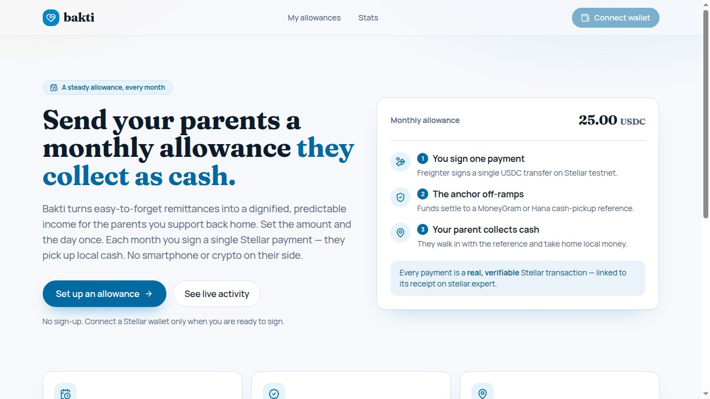
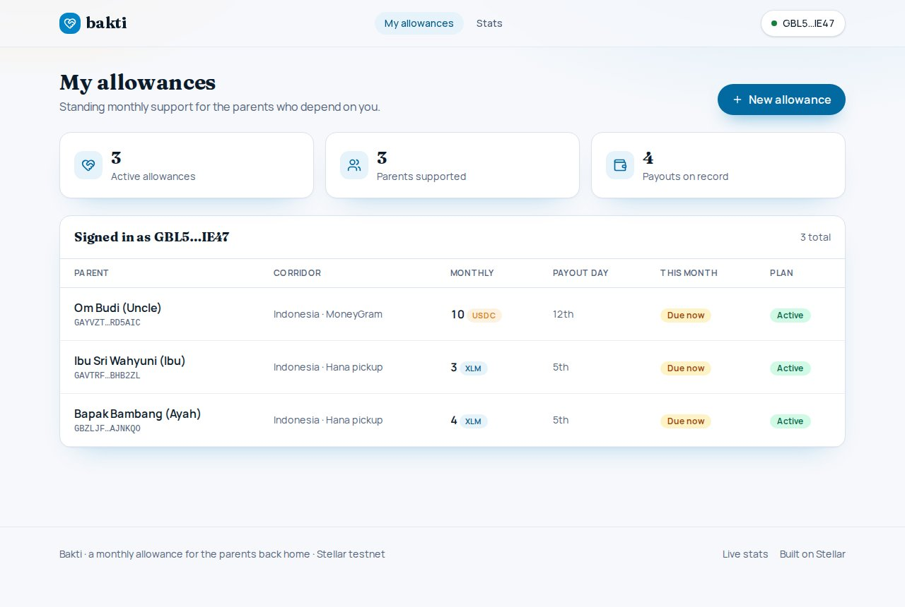
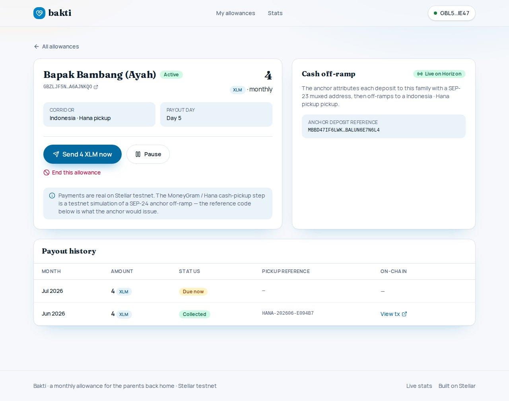
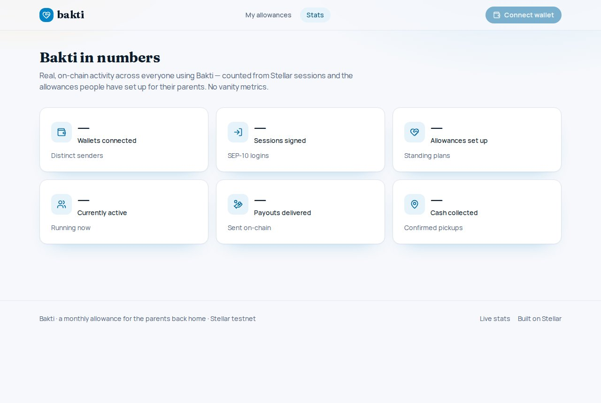
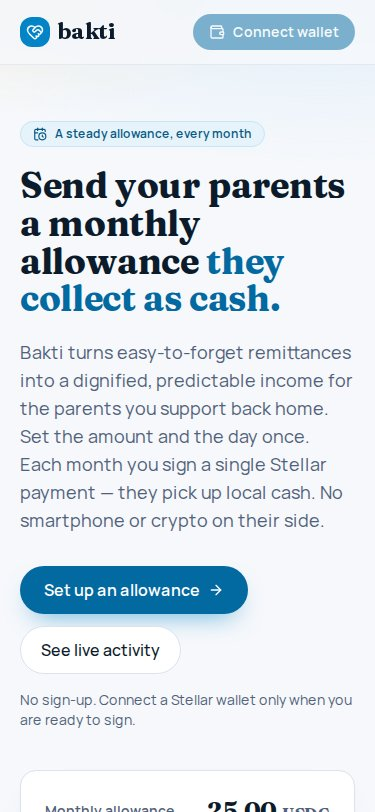

<div align="center">

## Mainnet (LIVE)

- **Live app:** https://bakti-sooty.vercel.app
- **Network:** Stellar public (mainnet)
- **Soroban contract:** `CBVAZDK2GAX5MJ7SSSQKRLY33TO7Q6DG3ZGZK6WMZSGI63XRMIR2CTHR`
- **Explorer:** https://stellar.expert/explorer/public/contract/CBVAZDK2GAX5MJ7SSSQKRLY33TO7Q6DG3ZGZK6WMZSGI63XRMIR2CTHR

# Bakti — a monthly allowance your parents collect as cash

**Turn easy-to-forget remittances into a steady, provable monthly income for the parents back home. You sign one Stellar payment a month; they walk into a cash pickup point with a reference code and take home local money — no wallet, no crypto on their side.**

Stellar APAC Hackathon 2026 · Track A


 
 

</div>

---

## The moment

"I always meant to send money to Ayah."

Dewi is an Indonesian caregiver in Singapore. Some months she remembers to send money home to her parents in Malang. Some months she forgets — between double shifts, it slips away. When she forgets, her father stretches his medicine.

He does not use crypto. He uses the corner pickup shop.

Bakti: Dewi does not want a transfer. She wants a standing allowance she can trust to land every month.

## The problem

Remittances reach the wallet. They do not reach the habit.

SEA takes in over $100 billion a year in remittances — much of it children supporting elderly parents. The average cost of sending $200 globally is still **6.4%** (WB Remittance Prices Q4 2024).

Support is ad-hoc: it depends on the sender remembering in a busy month. Apps charge opaque fees. No clean audit of what landed. The recipient is often elderly and cannot use a wallet or an app. A missed month is not abstract — it is skipped medicine or groceries.

## The market

- **Philippines 2024 inflow: ~$38 billion USD** (World Bank / KNOMAD). Forecast 2025: $38.3 billion. Trajectory toward $40 billion by 2026.
- **Top sources into PH:** Saudi Arabia, UAE, USA, Singapore, Hong Kong, Qatar, Kuwait, Japan, UK, Canada.
- **Malaysia sends $10-12 billion a year** to PH, ID, BD, NP, IN workers. MY-PH is the densest single intra-Asia remittance lane.
- Global average cost of sending $200: **6.4%** (WB Q4 2024). Bakti target: **2% or less** once live anchor signs.

## The solution

Set it once. Sign one payment a month. They collect cash.

**Step 1 — Add a parent.** Name, Stellar address, corridor, amount, payout day.

**Step 2 — Sign the month.** One XLM or USDC payment, signed in your own wallet.

**Step 3 — Anchor off-ramps.** A cash-pickup reference is issued. Currently demo; a live SEP-24 anchor partnership is in progress.

**Step 4 — They collect.** Local cash in hand — no wallet, no crypto on their side.

Non-custodial the whole way: Bakti never holds your keys or your funds.

## Why Stellar

**The only chain where this ends in cash.** Anchors and SEP-24 provide a real, standardized path from stablecoin to local cash pickup.

- **Sub-cent fees** — a $25 allowance is not eaten by the rails.
- **USDC on Stellar** — natively issued by Circle. No bridged assets. No counterparty risk.
- **Soroban BaktiEscrow** — permissionless keeper release. Non-custodial. Auditable on-chain.
- **SEP-23 muxed accounts** — one anchor collection account, per-family attribution, no memos.
- **SEP-10** — wallet auth built into the protocol.

## Architecture

**Client:** React + Freighter wallet signs `create_schedule` and each release.

**Contract:** BaktiEscrow on Soroban — pre-funds the full run, releases one month per call.

**Off-ramp:** SEP-24 anchor issues pickup reference; SEP-23 attributes it per family.

Tech: Next.js 16, React 19, TypeScript, Stellar SDK, Soroban, Rust, Drizzle, Postgres.

## Live proof

Not a mockup. A real mainnet payout.

- **Live app:** https://bakti-sooty.vercel.app
- **Soroban contract (mainnet):** `CBVAZDK2GAX5MJ7SSSQKRLY33TO7Q6DG3ZGZK6WMZSGI63XRMIR2CTHR`
- **On-chain release tx:** `cfa17a939f5cd0c90bc674d7cee61f0f4a67ed4c2f11ab3c789b0e3ad0c419d2`
- **Verify:** stellar.expert/explorer/public/tx/cfa17a939f5cd0c90bc674d7cee61f0f4a67ed4c2f11ab3c789b0e3ad0c419d2

## Anchor integration

SEP-24: standardized off-ramp. Bakti is the SEP-24 wallet client. SEP-10: user signs the challenge; Bakti server exchanges it for an anchor JWT. POST /withdraw/interactive sends destination (muxed), asset, amount. GET /transaction polls until status=completed; pickup_ref = transaction_id.

**Target anchor:** Coins.ph (Philippines, Bangko Sentral ng Pilipinas registered VASP). Off-ramp is demo until a live SEP-24 anchor signs.

## Go-to-market

1. **Philippines first.** Coins.ph ecosystem + OFW Facebook groups + diaspora orgs + remittance clinics in Saudi Arabia and UAE.
2. **Malaysia to Philippines second.** Existing high-volume corridor, mature, competitive.
3. **Indonesia, Vietnam, Thailand.** Expansion once anchor coverage confirmed per corridor.

## Business model

Target: take rate on the on-ramp leg once a fiat partner signs. Anchor referral fee for driving users to SEP-24 partners. Bakti never holds funds — non-custodial by design.

## Anchor integration plan

SEP-24 minimum endpoints: GET /info, POST /withdraw/interactive, GET /transaction + SEP-10 web auth. Cash_pickup type must be listed in /info. Bakti needs: transaction_id as the pickup reference. One anchor account with SEP-23 muxed attribution per family. No memos required from sender wallets.

## Highlights

- **Non-custodial** — you sign every payment in your own wallet. Bakti never holds keys or funds.
- **Provable, not opaque** — every payout is a real Stellar transaction, verified against Horizon, linked on stellar.expert.
- **Cash at the other end** — the SEP-24 off-ramp turns USDC/XLM into a cash-pickup reference. No crypto on the receiver side.
- **SEP-23 muxed attribution** — one anchor account, unique deposit reference per family.
- **SEP-7 pay link** — pay a month by QR from any Stellar wallet.
- **XLM-first, USDC opt-in** — one-tap changeTrust enables USDC. No stranded at op_no_trust.
- **Predictable** — a fixed plan with a fixed day, so support never gets forgotten.

## On-chain primitives

| Primitive | Role |
| --- | --- |
| BaktiEscrow (Soroban) | create_schedule escrows the full run; release is permissionless keeper call paying one period |
| SEP-10 | Wallet login via signed challenge |
| Payment (USDC classic) | Monthly allowance, signed once, verified against Horizon |
| Horizon verification | Server re-derives and confirms each payout on-chain |
| Soroban RPC | Server assembles/submits contract invokes, polls to SUCCESS |
| SEP-23 muxed accounts | Per-allowance attribution on one anchor collection account |
| SEP-24 | Off-ramp to cash-pickup reference (demo mode; live anchor TBD) |
| SEP-7 | Payment request URI for QR pay from any wallet |
| Horizon SSE | Live settlement indicator |

Cadence note: `LEDGERS_PER_PERIOD = 60` (~5 minutes on testnet) — this is a demo cadence only. Production would use `518_400` ledgers (~30 days).

## FRONTEND → CONTRACT WIRING

```
POST /api/allowances/escrow-intent           -> buildEscrow    -> create_schedule (build)
POST /api/allowances (signedXdr)             -> createEscrowed  -> create_schedule (submit)
POST /api/allowances/:id/release-intent      -> buildRelease    -> release (build)
POST /api/allowances/:id/payouts (signedXdr) -> recordRelease   -> release (submit)
```

Key files: `src/server/stellar/contract.ts`, `src/server/service/allowance.service.ts`, `src/server/service/payout.service.ts`, `contracts/bakti-escrow/src/lib.rs`.

## Tech stack

- **Soroban / Rust** — bakti-escrow contract, soroban-sdk 22
- **Next.js 16** (App Router) + **React 19** + **TypeScript** strict
- **@stellar/stellar-sdk** (Horizon + Soroban RPC) + **Freighter** for signing
- **Drizzle ORM** on **Postgres**
- **Tailwind CSS v4** + **Manrope + Fraunces** type + **lucide-react**
- **Vitest** (unit) + **Playwright** (e2e)
- Network-aware: flip `NEXT_PUBLIC_STELLAR_NETWORK` from testnet to public to go mainnet.

## Docs & slides

- `docs/SUBMISSION.md` — problem, market, solution, business model, GTM, why Stellar
- `docs/design.md` — UX principles, screen flow, status machine
- `docs/technical-flow.md` — end-to-end technical flow with file references
- `docs/description.md` — one-paragraph product blurb
- `slides/Bakti.pptx` — pitch deck (11 slides, 16:9)
- `contracts/DEPLOYMENT.md` — contract deployment record

## Quick start

```bash
pnpm install
cp .env.example .env.local
# set DRIZZLE_DATABASE_URL and a 32+ char SESSION_SECRET in .env.local
pnpm run db:push
pnpm run seed        # Indonesian persona + one real testnet payout
pnpm run dev         # http://localhost:3005
```

---

<div align="center">

**Bakti — a dignified monthly allowance for the parents back home. Built on Stellar.**

</div>
