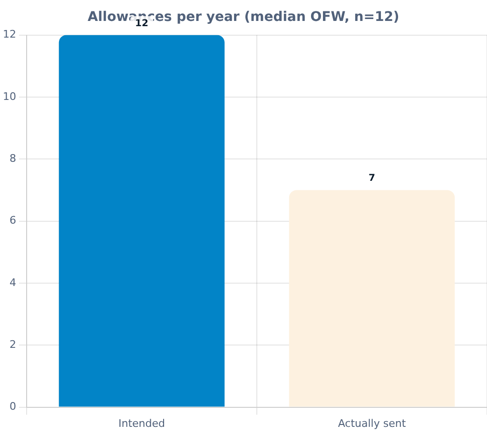
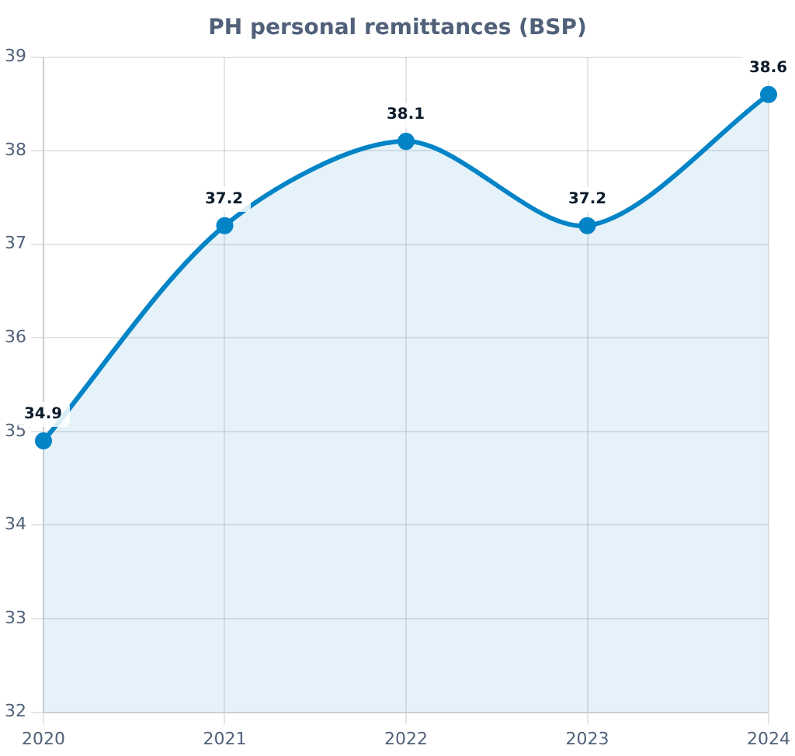
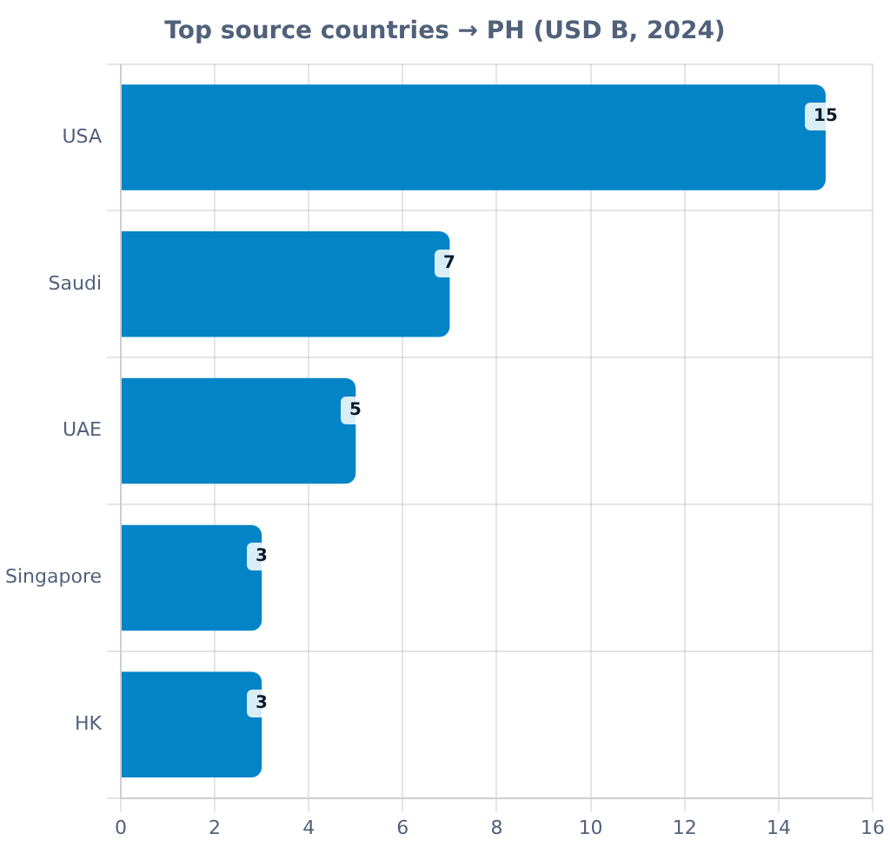
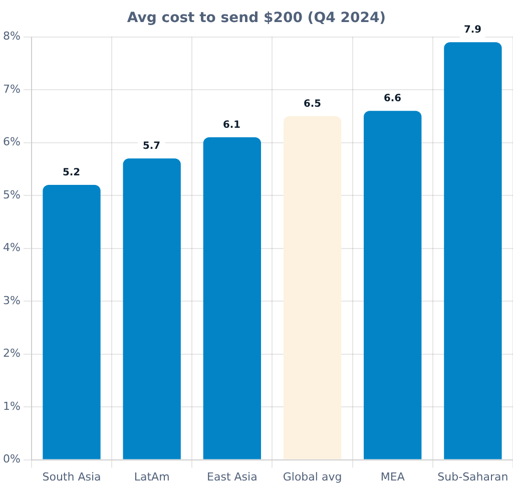
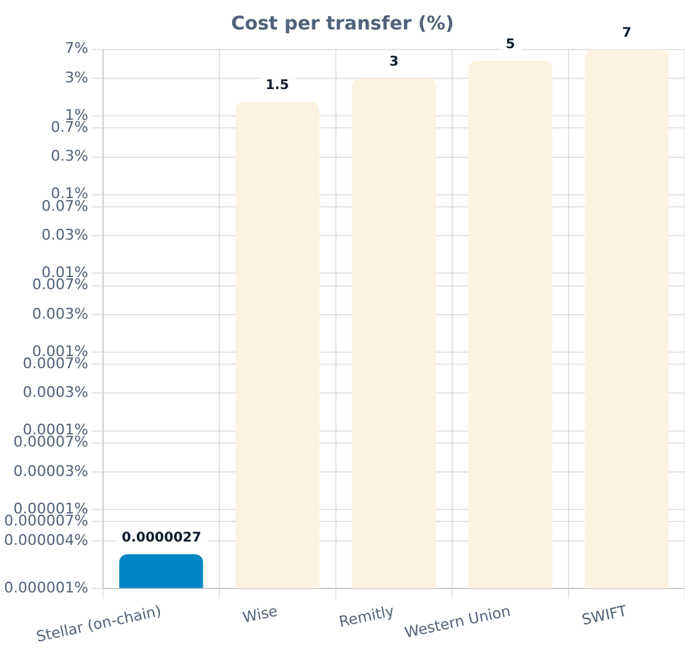
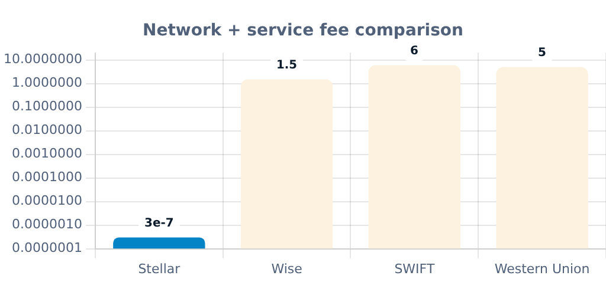

<!-- _class: lead -->

# A monthly allowance your parents collect as cash.

Stellar APAC Hackathon 2026 · Track A

You sign one Stellar payment a month. They walk into a pickup point and take home local money — no wallet, no crypto on their side.

mainnetLive on Stellar public network

SorobanOn-chain escrow contract

SEP-24Standardized cash off-ramp

---

## The moment

# "I always meant to send money to Ayah."

Dewi is a caregiver from Indonesia, working in Singapore.

Some months she remembers to send money home. Some months — between double shifts — it slips away.

When she forgets, her father stretches his medicine.

He doesn't use crypto. He uses the corner pickup shop.

**Dewi doesn't want a transfer. She wants a standing allowance she can trust to land every month.**

Bakti

---

## The problem

# Remittances reach wallets. They don't reach habits.

- SEA diaspora sends **>$100B** home each year — much of it children supporting elderly parents
- Ad-hoc: depends on the sender remembering in a busy month
- Apps charge opaque fees; no clean audit of what landed
- A missed month = skipped medicine or groceries

Source: World Bank Migration &amp; Remittances data (KNOMAD, 2024)

---

## Market

# Philippines remittances — $38.6B (2024)

 

Source: Bangko Sentral ng Pilipinas (2024); +3% YoY

---

## Why it costs so much

# 6.5% global avg — a $25 allowance loses $1.63 to fees

 

Sources: World Bank RPW (Q4 2024) · stellar.org/developers

---

## Solution

# Standing allowance. Local cash. Fixed day.

| 1 · Add a parent | 2 · Sign the month | 3 · Anchor off-ramps | 4 · They collect |
|---|---|---|---|
| Name, Stellar address, corridor, amount, payout day | One XLM or USDC payment, signed in your own wallet | Cash-pickup reference issued (SEP-24, simulated anchor today) | Local cash in hand — no wallet, no crypto on their side |

**Non-custodial the whole way — Bakti never holds your keys or your funds.**

`Dewi` → `Soroban BaktiEscrow (releases monthly)` → `SEP-24 Anchor` → `Cash pickup`

---

## Why Stellar

# The only chain where the last mile ends in cash.

SorobanPermissionless escrow · on-chain

USDCCircle-issued · native on Stellar

SEP-24Standard cash off-ramp

SEP-23Muxed attribution per family

SEP-23 muxed attribution &nbsp; SEP-24 standardized off-ramp &nbsp; SEP-7 QR pay links

Source: stellar.org/developers · stellar.org/case-studies/moneygram

---

## Live proof

# Not a mockup. Contract and app live on mainnet.

bakti-stellar.vercel.appLive app · mainnet

CBVAZDK…CTHRSoroban contract · mainnet

cfa17a93…419d2End-to-end payout · testnet

- → bakti-stellar.vercel.app
- → stellar.expert → end-to-end payout (testnet)
- → stellar.expert → contract (mainnet)

Source: Stellar public network (contract, app) · Stellar testnet (payout proof)

---

## Current vs target

# Phase 1 shipped. Phase 2 is one anchor away.

**Phase 1 — shipped**
- Soroban BaktiEscrow on mainnet
- Non-custodial signing
- Signed-challenge auth (not SEP-10) · SEP-23 / SEP-7 wired
- SEP-24 `cash_pickup`, simulated anchor
- Payout proven end-to-end on testnet

**Phase 2 / 3 — target**
- Anchor: **MoneyGram Access** or **Coins.ph**
- Config swap, not a rewrite
- Real 30-day cadence
- Multi-corridor, licensed rails

What's real today: contract, app, every signed payment — all on Stellar mainnet.

---

## The ask

# Pilot an anchor. Open one corridor.

Pilot SEP-24 anchor (cash_pickup)

Intro to PH diaspora org in the Gulf

Funding for legal review

Contact: Bakti · GitHub issues

---

<!-- _class: lead -->

# A standing allowance for parents back home.

Built on Stellar · Live on mainnet · Ready to pilot.

bakti-stellar.vercel.appLive app

Bakti · GitHubSource & issues

Stellar APAC Hackathon 2026 · Track A
