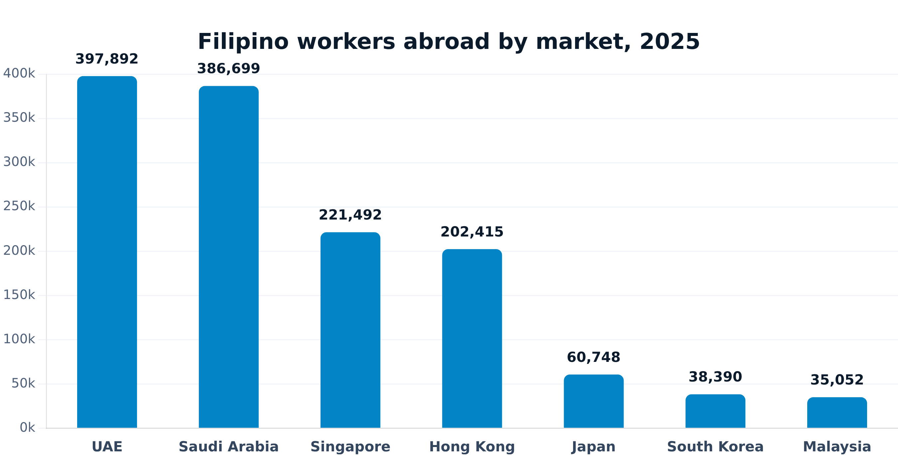
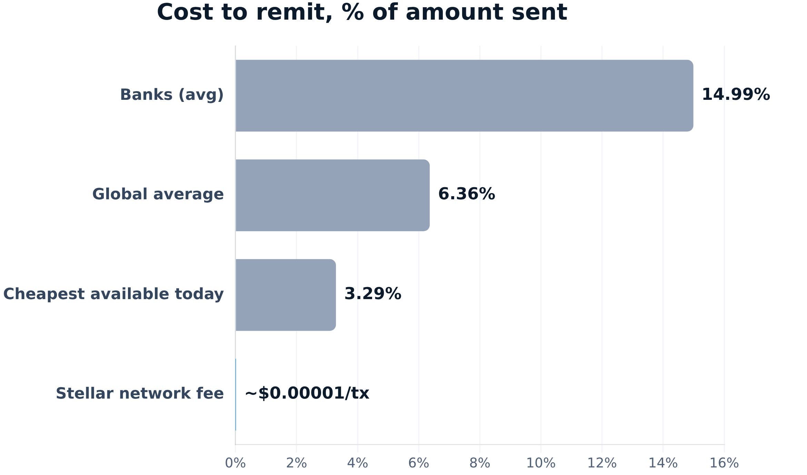
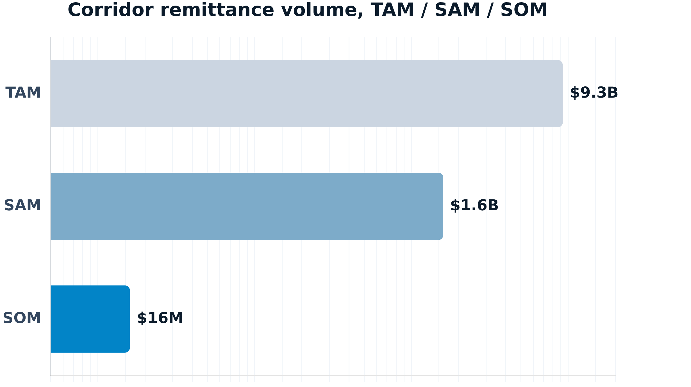

<!-- _class: lead -->

# Bakti

Plan salary-day support. Verify the transfer.

Filipino workers abroad, family in the Philippines

Stellar mainnet product

Non-custodial signing

Licensed cash-out: next integration target

bakti-stellar.vercel.app · Stellar APAC Hackathon 2026 · Track A

---

## The moment

# "I meant to send it. The week got away from me."

Illustrative persona, not a claimed interview

Maria works in Singapore, one of over 221,000 Filipino workers there. Payday comes. Some months she remembers to send money home, some months a long shift pushes it to next week. She wants a standing plan she sets up once, then signs each month on a habit, not from memory.

**Her mother, back home in the Philippines, has never used a banking app. What she actually wants is to walk in, show her ID, and leave with cash.** Today the recipient still needs a Stellar address. Cash pickup for her mother is the target, not built yet.

---

## Corridor evidence

# One anchor in the Philippines reaches every market Filipino workers send from

Only the receiving side needs a Stellar anchor. Wherever the sender is, they just need XLM/USDC sitting in their own wallet. Singapore's OFWs alone also account for 7.3% of all 2025 PH cash remittances, the #2 source country after the US.

Sources: DMW/OFW deployment reporting via businessmirror.com.ph · Bangko Sentral ng Pilipinas cash remittance data

---

## Product today vs next

# Plan, sign, and verify on-chain today

Today · working
<ul>
<li>Freighter + custom signed <code>manageData</code> session, not SEP-10</li>
<li>Support-plan records; reminder day is metadata only</li>
<li>XLM escrow/release, 60-ledger demo cadence</li>
<li>Direct XLM/USDC to a recipient address the sender enters and confirms</li>
<li>Horizon/RPC verification, SEP-7 link, recipient watcher</li>
<li>Status ends at <strong>Verified on-chain</strong></li>
</ul>

Next · planned
<ul>
<li>Licensed provider onboarding, KYB/compliance, agreements</li>
<li>SEP-1 + provider SEP-10 + hosted SEP-24</li>
<li>KYC, quote/limits, approved deposit routing</li>
<li>Provider transaction status and reference</li>
<li>PHP cash-out and provider-confirmed collection</li>
</ul>

---

## One simple flow

# Sender → Stellar → Anchor → Receiver

<strong>Sender</strong>Filipino worker, any market

→

<strong>Stellar</strong>Direct payment or XLM escrow, signed by sender

→

<strong>Anchor</strong>MoneyGram Ramps, real and live in PH, Bakti's connection is next

→

<strong>Receiver</strong>Her mother, cash in hand, no wallet needed

Solid border = built today. Dashed = planned, not yet connected. Once the anchor connects, funds land in MoneyGram's own Stellar account, then flow into their agent network across the Philippines. Her mother just needs a reference number and a photo ID to walk out with cash. No wallet, no app.

---

## Why Stellar; why one anchor is enough

# One Philippines anchor serves every sending market

Architecture
<ul>
<li>Only the receiving side needs a Stellar anchor. A sender in the UAE, Saudi Arabia, Singapore, or anywhere else just needs XLM/USDC in their own wallet, bought on any exchange</li>
<li>No separate integration per sending country, no separate deal per market</li>
<li>The Philippines is the one place Bakti needs a licensed cash-out partner</li>
</ul>

Confirmed anchor
<ul>
<li>MoneyGram Ramps is real and live. Been running in the Philippines since October 2021, one of the first four countries when MoneyGram launched this with Stellar, alongside Canada, Kenya, and the US</li>
<li>Funds land in MoneyGram's own Stellar account. The recipient just shows a reference number and photo ID to pick up cash, no wallet needed</li>
<li>What's still pending is Bakti's own connection to it: an email is out, no reply yet, nothing's confirmed as a partner</li>
</ul>

Sources: stellar.org/case-studies/moneygram-international (2021 launch) · developer.moneygram.com/integrate-moneygram-ramps

---

## Why Bakti, not the alternatives

# Classic remittance is transactional. Bakti is a standing habit with on-chain proof.

Classic apps and bank transfers are one-off: no standing plan, no proof beyond a receipt, and the recipient still needs a bank account or a wallet of their own. Bakti's target is different on all three: no wallet needed on the recipient's side, a verifiable Stellar transaction the sender can point to, and a monthly habit instead of "did I remember this month." The network layer itself costs next to nothing; the number still missing is the anchor's own cash-out quote.

Source: World Bank Remittance Prices Worldwide, Q3 2025

---

## Market size

# TAM $9.3B, SAM $1.6B, SOM $16M: a funnel, not a guess

TAM: 2025 cash-remittance volume from 5 of Bakti's 7 confirmed sending markets (UAE, Saudi Arabia, Singapore, Japan, Hong Kong); a floor, since BSP doesn't break out South Korea or Malaysia separately. SAM applies each market's own crypto-ownership rate, the senders who already hold crypto today. SOM is a 1% target slice of SAM for year one or two, not a revenue forecast.

Sources: Bangko Sentral ng Pilipinas cash remittance data, 2025 · Triple-A, State of Global Cryptocurrency Ownership 2024

---

## Business model + GTM

# A fee on real volume, not a list of ideas

Unvalidated business model
<ul>
<li>Primary: a sender-paid service fee bundled into the licensed provider's quote. At an illustrative 2% (under the 6.36% world average), capturing SOM's $16M target volume is roughly $320K in year one/two fee revenue, an illustrative target, not a forecast</li>
<li>Secondary: provider referral or revenue share where contractually permitted</li>
<li>Institutional: employer, cooperative, or worker-community distribution paid by an organization instead of the individual</li>
<li>Not yet validated: actual fee tolerance, provider revenue-share terms, or per-transaction unit economics</li>
</ul>

GTM experiments
<ul>
<li>Interview Filipino workers abroad (any market) and family recipients in the Philippines</li>
<li>Test planning/reminder value before automation</li>
<li>Follow up on the MoneyGram Ramps email, without claiming a partnership</li>
<li>Map how senders in each market actually acquire XLM/USDC today (exchange on-ramps in UAE, Saudi Arabia, Singapore), the same senders SAM counts</li>
<li>Run testnet usability studies for signing and address safety</li>
</ul>

Source: World Bank Remittance Prices Worldwide, Q3 2025

---

## Build status + ask

# A working mainnet core, with an honest last-mile gap

Built
<ul>
<li>Contract itself: live on mainnet since 2026-07-12, creator key under review</li>
<li>Separately: a fresh, judge-facing demo transaction is pending, to be signed before submission</li>
<li>Direct payment verification and support-plan UI</li>
<li>Current endpoints stop at Verified on-chain</li>
</ul>

Ask
<ul>
<li>Warm introduction to MoneyGram Ramps, or feedback on the outreach email already sent</li>
<li>Customer-discovery introductions among Filipino worker communities abroad</li>
<li>Feedback on the planning job before adding automation</li>
</ul>

Not built: SEP-24, anchor API/webview, KYC, provider routing/status/reference, PHP cash-out, automatic scheduling. Contract: CBVAZDK2GAX5MJ7SSSQKRLY33TO7Q6DG3ZGZK6WMZSGI63XRMIR2CTHR, stellar.expert/explorer/public/contract/CBVAZDK2GAX5MJ7SSSQKRLY33TO7Q6DG3ZGZK6WMZSGI63XRMIR2CTHR

---

<!-- _class: lead -->

# The target value, in one line.

A sender signs once a month. Her mother just walks in and picks up cash. No wallet, no app to install, nothing about blockchain to figure out. That part isn't built yet. It's exactly what the anchor connection is for.

bakti-stellar.vercel.app, live app

Bakti · GitHub, source & issues

Stellar APAC Hackathon 2026 · Track A
